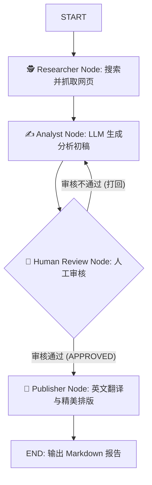

# 🚀 Auto-Research-Agent: 基于 LangGraph 的多智能体深度研报生成系统

本项目是一个基于 **LangGraph** 构建的企业级多智能体自动化行业研究系统。摒弃了传统的黑盒 Agent 模式，采用**状态机（StateGraph）**精确控制业务流转，并内置 **Human-in-the-loop (人机协作)** 机制，确保最终输出的分析报告兼具 AI 的高效与人类的专业审核。

## ✨ 核心亮点

- **🕸️ LangGraph 细粒度控制**：构建了 `Researcher` -> `Analyst` -> `Human_Review` -> `Publisher` 的有向图工作流，支持审核打回的循环重写（Cyclic Loop）。
- **🛡️ 降维突破反爬限制**：将底层爬虫工具与 [Jina Reader API](https://jina.ai/reader/) 深度结合，无需维护代理池即可将任意网页直接转化为纯净的 Markdown 数据。
- **👥 人机协作 (Human-in-the-loop)**：在研报发布的关键节点挂起程序，等待人类主编输入 `Y` 或修改意见，完美契合企业级业务的安全与严谨性要求。
- **🌐 动态联网检索**：接入 DuckDuckGo Search 引擎，根据 Topic 自动检索前沿资讯并完成多源数据合并。

## 🏗️ 架构设计 (Workflow)

